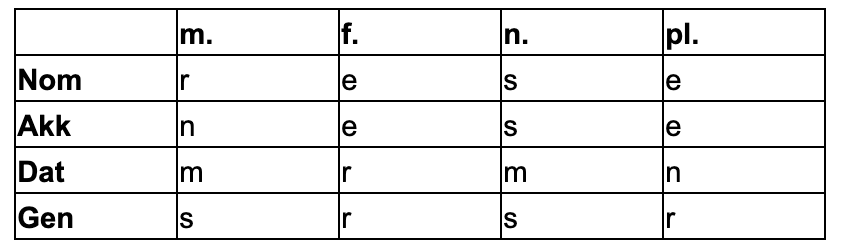

# Adjektivendungen

## The basis

Remember the basic rules of 4 cases: **„rese / nese / mrmn / srsr“**

See also: [Relativsätze](../satzverbindungen/relativsaetze.md).

## Nach dem unbestimmten Artikel

ein, mein, kein

## Nach dem bestimmten Artikel

der die das, dieser, jeder, jener, mancher, welcher

* **Der** **alte**⚠️ Mann schiebt **das** **langsame**⚠️ Auto.
* **Das** **langsame**⚠️ Auto ist schön.

## **Ohne Artikel**

manch, etwas, mehr, welch, viel, wenig, deren, zahlen

Genitiv: Sr Sr -&gt; Nr Nr

